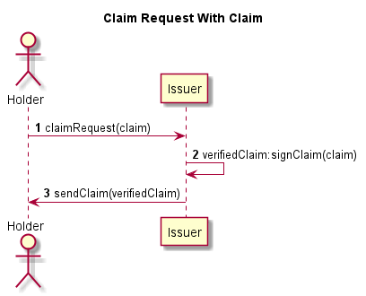
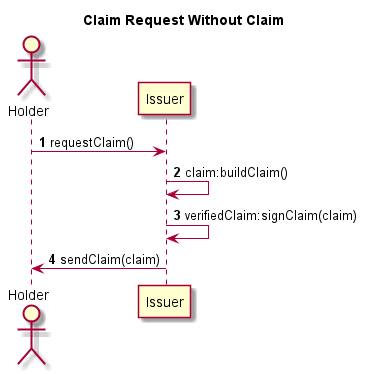
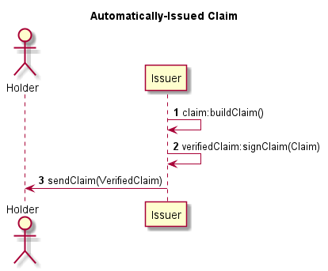
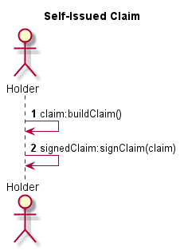
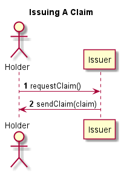
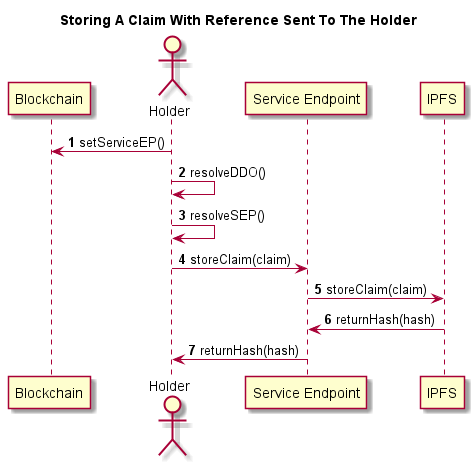
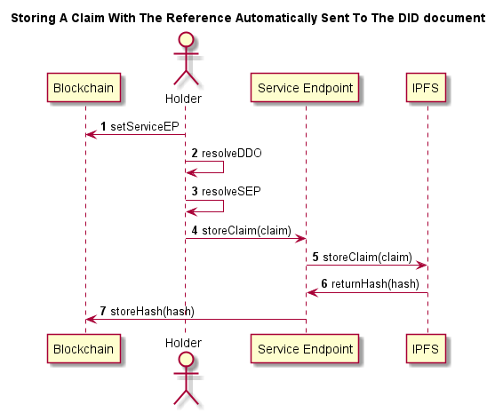
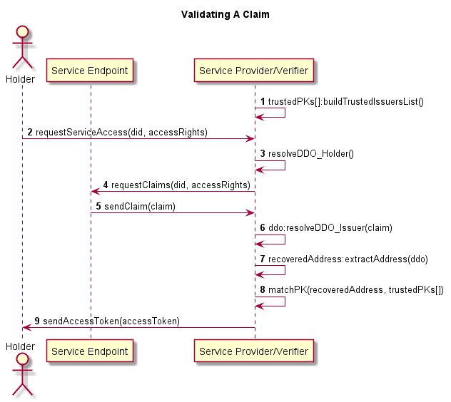

# interlinkedprotocol Specs
The Interlinked Protocol provides an interoperable digital fabric for digital twinning and agent-to-agent transactions to exchange data, digital assets, physical value and services in a privacy-preserving way.
## Flowcharts
The following flowcharts show different scenarios where the interlinkedprotocol can be applied.
###Highlevel Claim Creation
Below are possible ways to receive a claim.

1. The holder sends a claim request, including the `claim` object to be signed, to the Issuer.
2. The issuer signs the `claim` object.
3. A `verifiedClaim` is sent back to the requester.

1. The holder sends a claim request.
2. The issuer builds a `claim`.
3. The issuer signs the `claim`.
4. The `verifiedClaim` is sent back to the requester.

1. The issuer builds a `claim`.
2. The issuer signs the `claim`.
3. The issuer sends the `verifiedClaim` to the Holder.

1. The holder builds a `claim`.
2. The holder signs the `claim`.
### Issuing A Claim

1. The holder requests a `claim`.
2. The issuer sends a `claim`.
### Storing A Claim

1. The holder sets the service endpoint inside his DID document.
2. The holder resolves his new DID document.
3. The holder retrieves from this did document his service endpoint.
4. The holder sends his `claim` to the service endpoint.
5. The service endpoint stores the `claim` on an interplanetary file system (IPFS).
6. The IPFS returns the hash address back to the Service endpoint.
7. The service endpoint returns the hash address back to the holder.

1. The holder sets the service endpoint inside his DID document.
2. The holder resolves his new DID document.
3. The holder retrieves from this did document his service endpoint.
4. The holder sends his `claim` to the service endpoint.
5. The service endpoint stores the `claim` on an interplanetary file system (IPFS).
6. The IPFS returns the `hash` address back to the Service endpoint.
7. The service endpoint stores the `hash` address in the DID document .

### Validating A Claim

1. The Service Provider creates a list of trusted issuers.
2. The holder sends a request to access a service from the Service Provider and includes his `did` as well as `accessRights` to certain claims.
3. The Service Provider resolves the DID document of the requester (holder).
4. The Service Provider requests an appropriate claim of the holder, for which it has `accessRights`, from the Service Endpoint.
5. The Service Endpoint sends back the `claim`, if the Service Provider has access.
6. The Service Provider resolves the DID document of the issuer of the claim.
7. The Service Provider extracts the `recoveredAddress` from the DID document of the issuer.
8. The Service Provider matches the public key of the `recoveredAddress` with the `trustedPKs` list.
9. If the claim is valid and stems from a trusted issuer, the Service Provider will grant access to the requested service by providing an `accessToken` to the Holder.